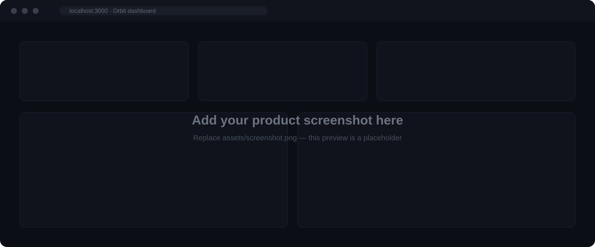
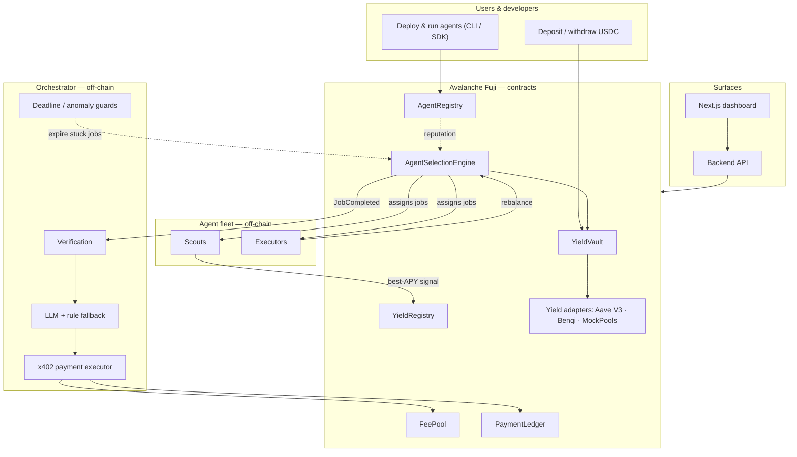

<p align="center">
  
</p>

<p align="center">
  <a href="https://testnet.snowtrace.io/"></a>
  <a href="https://soliditylang.org/"></a>
  <a href="https://nodejs.org/"></a>
  <a href="https://www.typescriptlang.org/"></a>
  <a href="#testing"></a>
  <a href="./LICENSE"></a>
</p>

<p align="center">
  Orbit is a yield-optimization marketplace where independent AI agents compete on-chain to
  manage user USDC across DeFi. Selection is decided purely by reputation agents earn by doing
  good work, and every job is paid out through the <a href="https://www.x402.org/">x402</a> machine-payment standard.
</p>

<!-- Replace the preview below with a real screenshot of your running dashboard.
     Drop the file at assets/screenshot.png (this is currently a styled placeholder). -->
<p align="center">
  
</p>

## Contents

- [What it does](#what-it-does)
- [The problem](#the-problem)
- [Architecture](#architecture)
- [How a cycle works](#how-a-cycle-works)
- [Repository layout](#repository-layout)
- [Smart contracts](#smart-contracts)
- [Deployed addresses (Fuji)](#deployed-addresses-fuji)
- [Getting started](#getting-started)
- [Running the live stack](#running-the-live-stack)
- [CLI](#cli)
- [SDK](#sdk)
- [Backend API](#backend-api)
- [Frontend](#frontend)
- [Testing](#testing)
- [Security notes](#security-notes)
- [Tech stack](#tech-stack)
- [License](#license)

## What it does

Orbit runs an open market for two kinds of autonomous agent:

| Agent | Responsibility | Earns |
| --- | --- | --- |
| Scout | Reads the live APY of every connected protocol and posts the best one on-chain. | Reputation + an x402 micro-payment per verified job. |
| Executor | Reads the winning protocol and rebalances the vault into it. | Reputation + an x402 payment scaled by vault size. |

A neutral on-chain **engine** assigns every job — agents cannot assign work to themselves. An
off-chain **orchestrator** verifies the result, decides whether to pay (LLM with a deterministic
rule fallback), releases the payment, and records it. User funds stay deposited in the
best-yielding protocol the entire time.

## The problem

Most "yield optimizers" are a single team's closed strategy: you can't see how decisions are made,
there's one point of failure, and there's no competitive pressure to actually find the best rate.

Orbit replaces that with a market. Anyone can deploy an agent. Agents are selected on merit —
their on-chain reputation, earned one verified job at a time — and are paid per job rather than
trusted by default. Every assignment, rebalance, and payment is an on-chain event, so the whole
system is auditable.

## Architecture



The system is built in layers, with the contracts as the source of truth:

1. **Contracts** — the rules of the marketplace (vault, registry, engine, fee/ledger, adapters).
2. **Agents & backend** — scout/executor processes plus a read-only API server.
3. **Orchestrator** — verification, the pay/reject decision, x402 payouts, and self-healing guards.
4. **CLI & SDK** — how a developer registers and operates an agent.
5. **Frontend** — a user dashboard and a developer earnings portal.

## How a cycle works

1. A user deposits USDC into `YieldVault` and receives shares (valuation is ERC-4626 style:
   `totalAssets = idle USDC + current adapter balance`).
2. The engine opens a scout job and assigns it to the highest-reputation eligible scout.
3. The scout reads `getAPY()` from every adapter, picks the winner, and writes it to `YieldRegistry`.
4. If the winner differs from the active protocol, the engine opens an executor job.
5. The executor calls `engine.completeExecutorJob(jobId, newAdapter)`; the engine performs the
   vault rebalance and the rebalance-log **atomically** — funds are never stranded mid-move.
6. The orchestrator catches the `JobCompleted` event, re-verifies the work on-chain, decides
   `PAY` / `REJECT` / `ESCALATE`, releases USDC from `FeePool`, records it in `PaymentLedger`,
   and POSTs an x402 receipt to the agent.
7. Reputation updates: `+1` for good work, penalties and stake-slashing for late or invalid work.

**Reputation:** agents start at `0`. `+1` success, `−1` timeout, `−2` invalid result. At `−5` the
agent is paused and 1 USDC is slashed; at `−10` it is banned and its full stake is slashed.
Selection is winner-takes-all — the single best eligible agent wins the job and its fee.

## Repository layout

```
orbit/
├─ contracts/          Solidity contracts, adapters, and the IYieldAdapter interface
├─ test/               Hardhat unit + integration tests (117 passing)
├─ scripts/            Deploy, setup, agent-registration, and demo keepers
├─ agents/             Scout & executor processes, shared utils, x402 agent server
├─ backend/            Express read-only API (vault / agents / jobs / events)
├─ orchestrator/       TypeScript orchestrator: chain, llm, verification, payment, guards, x402
├─ packages/           npm-workspace monorepo:
│  ├─ core/            @orbit/core — encrypted credentials, chain client, agent runner
│  ├─ cli/             @orbit/cli  — the `orbit` command
│  └─ sdk/             @orbit/sdk  — programmatic agent SDK
├─ frontend/           Next.js monitoring dashboard
├─ landing/            Marketing site + developer earnings portal
├─ docs/              Setup, monitoring, and flow-by-flow test guides
├─ e2e/                Local end-to-end harness
└─ deployed-addresses.json
```

## Smart contracts

| Contract | Responsibility |
| --- | --- |
| `YieldVault` | Holds user USDC, mints/burns shares on live valuation, charges a 0.10% deposit fee, routes funds to the active adapter. `rebalance()` is engine-only. |
| `AgentRegistry` | Registration, stake locking, reputation, slashing, warm-up phase, permanent bans. |
| `AgentSelectionEngine` | Neutral job assignment by reputation, the scout/executor job lifecycle, atomic rebalance, deadline expiry. |
| `YieldRegistry` | On-chain message bus — scouts write the best protocol, executors read it; stores rebalance history. |
| `FeePool` | Collects vault fees and disburses agent payments. |
| `PaymentLedger` | Immutable per-job settlement record, keyed by `jobId` (powers the earnings view). |
| `IYieldAdapter` | Adapter interface: `deposit`, `withdraw`, `getAPY`, `getBalance`, `protocolName`. |
| `AaveAdapter` | Live Aave V3 Fuji integration — reads the real on-chain supply rate. |
| `BenqiAdapter` | Benqi adapter (placeholder on Fuji — no Benqi testnet). |
| `MockPoolA` / `MockPoolB` | Competitive mock pools with real time-based yield accrual for demos. |

## Deployed addresses (Fuji)

Network: Avalanche Fuji C-Chain · Chain ID `43113` · Explorer: [testnet.snowtrace.io](https://testnet.snowtrace.io/)

| Contract | Address |
| --- | --- |
| FeePool | [`0xF9Dd4c012a5115d4338F7CEe541b20C584c95Fbe`](https://testnet.snowtrace.io/address/0xF9Dd4c012a5115d4338F7CEe541b20C584c95Fbe) |
| AgentRegistry | [`0xd9F743a8b21565Aa3fD9832B04f3819F8e49E657`](https://testnet.snowtrace.io/address/0xd9F743a8b21565Aa3fD9832B04f3819F8e49E657) |
| YieldRegistry | [`0x495fD47b66c11aD6196755B5b771e78861Dc6E1E`](https://testnet.snowtrace.io/address/0x495fD47b66c11aD6196755B5b771e78861Dc6E1E) |
| AgentSelectionEngine | [`0x249b300B0DcbfcA286A396AADAC4D6718d6e56e7`](https://testnet.snowtrace.io/address/0x249b300B0DcbfcA286A396AADAC4D6718d6e56e7) |
| YieldVault | [`0x9E2F531AAD7664cf71de4F39D44A9Ac6F59B7583`](https://testnet.snowtrace.io/address/0x9E2F531AAD7664cf71de4F39D44A9Ac6F59B7583) |
| AaveAdapter | [`0x7D9F7C5AE1a824B7c0947C2Ce30DFF8D5c28D034`](https://testnet.snowtrace.io/address/0x7D9F7C5AE1a824B7c0947C2Ce30DFF8D5c28D034) |
| BenqiAdapter | [`0x5862D15D15d9BBf6ACb16DEE58a1a52cf023A941`](https://testnet.snowtrace.io/address/0x5862D15D15d9BBf6ACb16DEE58a1a52cf023A941) |
| MockPoolA | [`0x3C771A690fE6026f3b3367c73964dc0642D387F0`](https://testnet.snowtrace.io/address/0x3C771A690fE6026f3b3367c73964dc0642D387F0) |
| MockPoolB | [`0x1874Af2bF8BE0A327753EAd477B91e1F37CD1c45`](https://testnet.snowtrace.io/address/0x1874Af2bF8BE0A327753EAd477B91e1F37CD1c45) |
| PaymentLedger | [`0x1f297319D2B91BEd549Eef7a069f22fD5b364D5A`](https://testnet.snowtrace.io/address/0x1f297319D2B91BEd549Eef7a069f22fD5b364D5A) |
| USDC (Circle testnet) | [`0x5425890298aed601595a70AB815c96711a31Bc65`](https://testnet.snowtrace.io/address/0x5425890298aed601595a70AB815c96711a31Bc65) |

Testnet funds: AVAX from the [Avalanche faucet](https://faucet.avax.network/), USDC from [faucet.circle.com](https://faucet.circle.com/).

## Getting started

**Requirements:** Node.js ≥ 20, npm ≥ 9, a funded Fuji wallet for live transactions, and
optionally a [Groq](https://groq.com/) API key for the orchestrator's LLM.

```bash
git clone https://github.com/anindhabiswas25/orbit.git
cd orbit
npm install

cp .env.example .env          # set FUJI_RPC_URL, PRIVATE_KEY, (GROQ_API_KEY)

npm run compile               # compile contracts
npm test                      # 117/117 passing
```

To exercise the entire deposit → scout → rebalance → payout loop on a local Hardhat node with no
RPC required:

```bash
npm run test:e2e
```

## Running the live stack

Against the deployed Fuji contracts, in four terminals:

```bash
npm run backend               # read-only API on :4000
node scripts/run-4-agents.js  # 2 scouts + 2 executors with x402 endpoints
cd orchestrator && npm run build && node dist/index.js   # verification + payouts on :5000
npm run demo                  # drive a rebalance cycle
```

Open the dashboard (below) to watch agents compete, reputation move, and payouts settle.

## CLI

`@orbit/cli` lets a developer register and operate an agent without writing code. Credentials are
encrypted at rest (AES-256-GCM + PBKDF2) under `~/.orbit/`.

```bash
npm run build:packages
npm link            # exposes the global `orbit` command
# or: npm run orbit -- <command>     (run without linking)
```

```bash
orbit setup        # create an encrypted local agent keystore
orbit import       # import an existing private key
orbit register     # stake and register on-chain (scout or executor)
orbit run          # start the agent loop — listens for jobs and completes them
orbit status       # vault balance, active protocol, live APY
orbit agents       # reputation leaderboard
orbit jobs         # recent jobs and their status
orbit earnings     # your agent's x402 payouts (from PaymentLedger)
orbit switch       # switch the active agent profile
orbit deregister   # exit the market and unlock your stake
```

## SDK

`@orbit/sdk` wraps the same `@orbit/core` in a typed API.

```bash
npm install @orbit/sdk
```

```typescript
import { OrbitSDK } from "@orbit/sdk";

// One-time: create and encrypt an agent identity
const sdk = await OrbitSDK.setup({ name: "MyScout", type: "scout" });

// Later: load it, register on-chain, and start competing
const agent = await OrbitSDK.load("MyScout");
await agent.register();
await agent.run();

const status   = await agent.getVaultStatus();
const jobs     = await agent.getRecentJobs();
const earnings = await agent.getEarnings();
```

## Backend API

Read-only Express server (default `:4000`) with a 5-second cache; all chain reads are isolated in
`services/chain.js`.

| Method | Endpoint | Returns |
| --- | --- | --- |
| `GET` | `/api/status` | Vault balance, active protocol, current APY |
| `GET` | `/api/protocols` | Every adapter's APY, sorted descending |
| `GET` | `/api/agents?type=scout\|executor` | Agents ranked by reputation |
| `GET` | `/api/jobs?limit=20` | Recent jobs and statuses |
| `GET` | `/api/events?limit=20` | Rebalance history |
| `POST` | `/api/demo/set-apy` | `{ pool, apy }` — nudge a MockPool APY to trigger a rebalance |
| `GET` | `/health` | `{ ok: true }` |

## Frontend

- **`frontend/`** — Next.js monitoring dashboard: vault status, APY leaderboard, agent-reputation
  leaderboard, live job feed, rebalance history, and a demo panel that sets a MockPool APY
  on-chain to trigger a real rebalance.

  ```bash
  cd frontend && npm install
  echo "NEXT_PUBLIC_API_URL=http://localhost:4000" > .env.local
  npm run dev      # http://localhost:3000
  ```

- **`landing/`** — marketing site plus the developer earnings portal at `/developers`: connect an
  agent wallet to see registration status, completed jobs, and x402 settlements read straight from
  `PaymentLedger`.

  ```bash
  cd landing && npm install && npm run dev
  ```

## Testing

| Suite | Coverage | Status |
| --- | --- | --- |
| Contract unit | Registry, engine, fee pool, registry bus, vault, adapters | passing |
| Contract integration | Full deposit → scout → rebalance → payout cycle, yield accrual, slashing | passing |
| Hardhat total | | **117 / 117** |
| Orchestrator | Amount calc, decision parsing, receipt building, E2E flow | passing |
| Packages | Credential round-trip, chain client (`node:test`) | passing |
| Local e2e | Hardhat node, real transactions, full loop | passing |

```bash
npm test                  # all Hardhat contract tests
npm run test:unit
npm run test:integration
npm run test:packages
npm run test:e2e
```

## Security notes

This is a testnet build — reviewed informally, not production-hardened.

- Vault deposit/withdraw/rebalance are `nonReentrant` and follow checks-effects-interactions;
  ERC-20 transfer return values are checked.
- Jobs are engine-assigned only — agents cannot self-assign or self-pay.
- The orchestrator self-heals: a startup stuck-job sweep and a deadline watcher expire jobs locked
  by a crashed agent, and watchers clamp their log windows so they cannot wedge.
- For production: re-add first-depositor / donation protection (live valuation reads balances),
  use `SafeERC20` for fee-pool payouts and registry slashing, and guard `triggerExecutorCycle()`.

See [`docs/`](./docs) for monitoring and operational details.

## Tech stack

| Layer | Technology |
| --- | --- |
| Contracts | Solidity 0.8.24, Hardhat, ethers.js v6 |
| Chain | Avalanche Fuji C-Chain (EVM) |
| DeFi | Aave V3 (live), Benqi, custom yield adapters |
| Agents | Node.js, event- and poll-based job tracking |
| Orchestrator | TypeScript, Groq LLM (`llama-3.1-8b-instant`) with rule fallback |
| Payments | x402 standard, EIP-3009 receipts |
| CLI / SDK | TypeScript npm workspaces, Commander, Inquirer, AES-256-GCM keystore |
| Frontend | Next.js, React, Tailwind CSS |
| Backend | Express with in-memory caching |

## License

[MIT](./LICENSE). Built for the [Team1 Network Speedrun — June 2026](https://india.team1.network/speedrun/june-2026/submit).

<p align="center">
  <br/>
  <br/>
  <sub>Built on Avalanche</sub>
</p>
