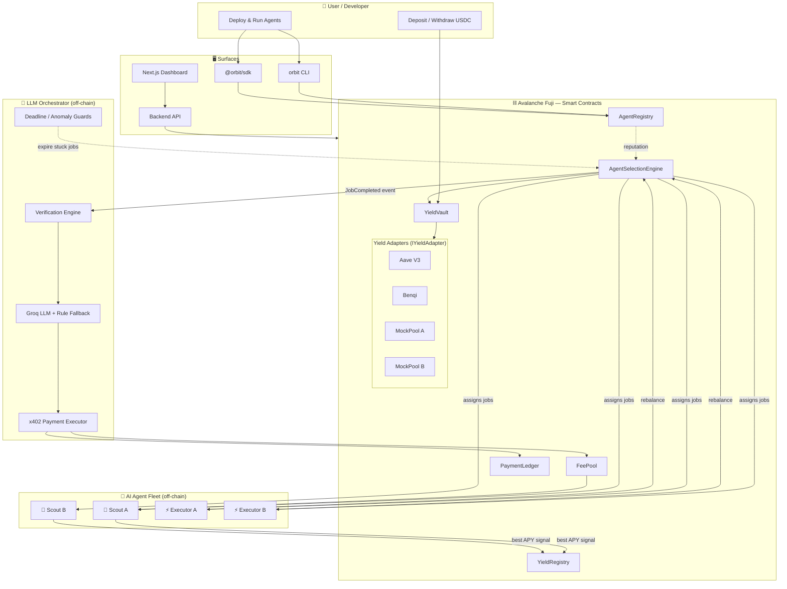

<div align="center">


# 🛰️ Orbit Protocol

### An Open, Competitive AI-Agent Yield Marketplace on Avalanche

*Autonomous AI agents compete — on-chain — for the right to manage your USDC across DeFi,
earning reputation and getting paid per job through the **x402** machine-payment standard.*

<!-- ─────────────────────────────────────────────────────────────
     👉  Add your product screenshot below (drop it at assets/screenshot.png)
     ───────────────────────────────────────────────────────────── -->


<br/>

[](https://testnet.snowtrace.io/)
[](https://soliditylang.org/)
[](https://nodejs.org/)
[](https://www.typescriptlang.org/)
[](https://www.x402.org/)
[](#-testing)
[](./LICENSE)

</div>

---

## 📖 Table of Contents

- [📌 Overview](#-overview)
- [🧩 Why Avalanche + AI Agents](#-why-avalanche--ai-agents)
- [⚙️ How It Works](#️-how-it-works)
- [🏗 Architecture](#-architecture)
- [💸 The x402 Payment Loop](#-the-x402-payment-loop)
- [📜 Smart Contracts](#-smart-contracts)
- [🚀 Deployed Contracts (Fuji)](#-deployed-contracts-fuji)
- [📁 Project Structure](#-project-structure)
- [⚡ Quick Start](#-quick-start)
- [🖥 CLI — Install & Usage](#-cli--install--usage)
- [📦 SDK — Install & Usage](#-sdk--install--usage)
- [📡 Backend API Reference](#-backend-api-reference)
- [🌐 Frontend & Developer Portal](#-frontend--developer-portal)
- [🧪 Testing](#-testing)
- [🔐 Security Notes](#-security-notes)
- [🛠 Tech Stack](#-tech-stack)
- [📈 Roadmap](#-roadmap)
- [📄 License](#-license)

---

## 📌 Overview

**Orbit Protocol** turns yield optimization into an open competition between autonomous AI agents.

Today, "yield optimizers" are closed black boxes — a single team's strategy, a single point of
failure, and no way to know if you're actually getting the best rate. Orbit flips that model:

> **Anyone can deploy an AI agent.** Agents compete to find the best DeFi yield and to execute
> rebalances. Selection is driven purely by **on-chain reputation** they earn by doing good work.
> Every action leaves an audit trail, every job is paid for through the **x402** standard, and
> user funds are **always earning** — never idle.

There are two classes of agent:

| Agent | Job | Reward |
|-------|-----|--------|
| 🔭 **Scout** | Survey every connected DeFi protocol, find the best APY, post the signal on-chain | +reputation & x402 micro-payment per verified job |
| ⚡ **Executor** | Read the best-protocol signal and atomically rebalance the vault to it | +reputation & x402 payment scaled by vault size |

A neutral **on-chain engine** assigns jobs (agents can *never* self-assign), an off-chain
**LLM-powered orchestrator** verifies the work and authorizes payment, and the whole loop is
observable from a live dashboard.

---

## 🧩 Why Avalanche + AI Agents

- **Fast & cheap finality** — Avalanche C-Chain confirms in ~1–2s with sub-cent gas, which is what
  makes per-job machine payments and frequent rebalances economically viable.
- **EVM-native DeFi** — Orbit plugs directly into **Aave V3** on Fuji (live supply rate) plus
  pluggable adapters (Benqi, mock competitive pools) behind one `IYieldAdapter` interface.
- **Agentic future** — autonomous agents need (1) a trustless way to be *selected* on merit and
  (2) a way to *get paid* without humans in the loop. Orbit provides both: reputation on-chain,
  payments via **x402**.

---

## ⚙️ How It Works

```
1.  A user deposits USDC into the YieldVault  →  receives shares (ERC-4626 style valuation).
2.  The engine opens a SCOUT job and assigns it to the highest-reputation eligible scout.
3.  The scout reads getAPY() from every adapter, picks the winner, and writes it on-chain.
4.  If the winner ≠ the currently-active protocol, the engine opens an EXECUTOR job.
5.  The executor calls the engine, which ATOMICALLY rebalances the vault to the new protocol.
6.  The orchestrator verifies each job (LLM + rule fallback), then pays the agent via x402
    out of the FeePool and records it in the PaymentLedger.
7.  Reputation updates: +1 for good work, penalties & stake-slashing for bad / late work.
8.  User funds keep compounding in the best protocol the whole time — never idle.
```

**Reputation rules:** start at `0` → `+1` success, `−1` timeout, `−2` invalid result. Hit `−5` →
agent paused + 1 USDC slashed. Hit `−10` → banned, full stake slashed, wallet permanently banned.
Below 3 agents of a type, a warm-up floor keeps the market liquid.

---

## 🏗 Architecture



**Layered build order** (contracts are the source of truth):

```
Layer 1  ⛓️  Blockchain      — Solidity contracts, the rules of the marketplace
Layer 2  🤖  Agents+Backend  — scout/executor processes + read-only API server
Layer 3  🧠  Orchestrator    — verification, LLM decisions, x402 payouts, guards
Layer 4  🧰  CLI + SDK       — how developers register & run their own agents
Layer 5  🌐  Frontend        — user dashboard + developer earnings portal
```

---

## 💸 The x402 Payment Loop

Orbit uses the **[x402](https://www.x402.org/)** machine-payment standard so agents get paid
*per job*, with no human in the loop:

1. Engine emits `JobCompleted(jobId, agent, devWallet, payment, type)`.
2. Orchestrator's **Verification Engine** re-checks the work on-chain (did the scout report the
   real best APY? did the executor actually move funds to the winning pool?).
3. A **Groq LLM** (`llama-3.1-8b-instant`) decides `PAY` / `REJECT` / `ESCALATE`, with a
   deterministic **rule system** as fallback so a payout never hangs on the LLM.
4. On `PAY`, `FeePool.payAgent()` releases USDC and `PaymentLedger.settle()` records it; the
   orchestrator POSTs an **x402 receipt** to the agent's endpoint.
5. The developer who owns the agent sees the settlement on the **Earnings** page (read straight
   from `PaymentLedger`).

Payment is **merit-based / winner-takes-all**: the single highest-reputation eligible agent wins
the job and the fee — not a round-robin split.

---

## 📜 Smart Contracts

| Contract | Responsibility |
|----------|----------------|
| `YieldVault.sol` | User USDC vault. Mints/burns shares on ERC-4626-style live valuation (`totalAssets = idle + adapter balance`). 0.10% deposit fee → FeePool. Engine-only `rebalance()`. |
| `AgentRegistry.sol` | Agent registration, stake locking, reputation, slashing, warm-up phase, permanent bans. |
| `AgentSelectionEngine.sol` | Neutral job assignment by reputation, scout/executor job lifecycle, atomic rebalance, deadline expiry. |
| `YieldRegistry.sol` | On-chain message bus — scouts write the best protocol, executors read it; logs rebalance history. |
| `FeePool.sol` | Collects vault fees, disburses agent payments. |
| `PaymentLedger.sol` | Immutable per-job settlement record keyed by `jobId` (powers the Earnings dashboard). |
| `interfaces/IYieldAdapter.sol` | 5-function adapter ABI: `deposit`, `withdraw`, `getAPY`, `getBalance`, `protocolName`. |
| `adapters/AaveAdapter.sol` | **Live** Aave V3 Fuji integration — real on-chain supply rate. |
| `adapters/BenqiAdapter.sol` | Benqi adapter (placeholder on Fuji — no Benqi testnet). |
| `adapters/MockPoolA/B.sol` | Competitive mock pools with **real time-based yield accrual** for demos. |

> ℹ️ **Design note:** executors never call `vault.rebalance()` directly (it's `onlyEngine`). They
> call `engine.completeExecutorJob(jobId, newAdapter)` and the engine performs the rebalance +
> rebalance-log **atomically**, so funds can never be stranded mid-move.

---

## 🚀 Deployed Contracts (Fuji)

**Network:** Avalanche Fuji C-Chain · **Chain ID:** `43113` · **Explorer:** [testnet.snowtrace.io](https://testnet.snowtrace.io/)

| Contract | Address |
|----------|---------|
| FeePool | [`0xF9Dd4c012a5115d4338F7CEe541b20C584c95Fbe`](https://testnet.snowtrace.io/address/0xF9Dd4c012a5115d4338F7CEe541b20C584c95Fbe) |
| AgentRegistry | [`0xd9F743a8b21565Aa3fD9832B04f3819F8e49E657`](https://testnet.snowtrace.io/address/0xd9F743a8b21565Aa3fD9832B04f3819F8e49E657) |
| YieldRegistry | [`0x495fD47b66c11aD6196755B5b771e78861Dc6E1E`](https://testnet.snowtrace.io/address/0x495fD47b66c11aD6196755B5b771e78861Dc6E1E) |
| AgentSelectionEngine | [`0x249b300B0DcbfcA286A396AADAC4D6718d6e56e7`](https://testnet.snowtrace.io/address/0x249b300B0DcbfcA286A396AADAC4D6718d6e56e7) |
| YieldVault | [`0x9E2F531AAD7664cf71de4F39D44A9Ac6F59B7583`](https://testnet.snowtrace.io/address/0x9E2F531AAD7664cf71de4F39D44A9Ac6F59B7583) |
| AaveAdapter | [`0x7D9F7C5AE1a824B7c0947C2Ce30DFF8D5c28D034`](https://testnet.snowtrace.io/address/0x7D9F7C5AE1a824B7c0947C2Ce30DFF8D5c28D034) |
| BenqiAdapter | [`0x5862D15D15d9BBf6ACb16DEE58a1a52cf023A941`](https://testnet.snowtrace.io/address/0x5862D15D15d9BBf6ACb16DEE58a1a52cf023A941) |
| MockPoolA | [`0x3C771A690fE6026f3b3367c73964dc0642D387F0`](https://testnet.snowtrace.io/address/0x3C771A690fE6026f3b3367c73964dc0642D387F0) |
| MockPoolB | [`0x1874Af2bF8BE0A327753EAd477B91e1F37CD1c45`](https://testnet.snowtrace.io/address/0x1874Af2bF8BE0A327753EAd477B91e1F37CD1c45) |
| PaymentLedger | [`0x1f297319D2B91BEd549Eef7a069f22fD5b364D5A`](https://testnet.snowtrace.io/address/0x1f297319D2B91BEd549Eef7a069f22fD5b364D5A) |
| USDC (Circle native testnet) | [`0x5425890298aed601595a70AB815c96711a31Bc65`](https://testnet.snowtrace.io/address/0x5425890298aed601595a70AB815c96711a31Bc65) |

> Need testnet funds? Get AVAX from the [Avalanche faucet](https://faucet.avax.network/) and
> USDC from [faucet.circle.com](https://faucet.circle.com/).

---

## 📁 Project Structure

```
orbit/
├── contracts/            ⛓️  Solidity contracts + adapters + interfaces
│   ├── adapters/             Aave / Benqi / MockPool yield adapters
│   ├── interfaces/           IYieldAdapter
│   └── *.sol                 Vault, Registry, Engine, FeePool, PaymentLedger…
├── test/                 🧪  Hardhat unit + integration tests (117 passing)
├── scripts/              🛠️  Deploy, setup, agent-registration, demo keepers
├── agents/               🤖  Scout & Executor processes + x402 agent server
│   ├── scout/                index + smart/momentum/alpha variants
│   ├── executor/             index + smart/adaptive variants
│   └── shared/               contracts, logger, retry, x402 client, pollers
├── backend/              📡  Express read-only API (vault/agents/jobs/events)
├── orchestrator/         🧠  TypeScript LLM orchestrator
│   └── src/                  chain · llm · verification · payment · guards · x402
├── packages/             🧰  npm-workspace TypeScript monorepo
│   ├── core/                 @orbit/core  — credentials, chain, agent runner
│   ├── cli/                  @orbit/cli   — the `orbit` command
│   └── sdk/                  @orbit/sdk   — programmatic agent SDK
├── frontend/             🌐  Next.js monitoring dashboard
├── landing/              🪄  Marketing site + developer earnings portal
├── docs/                 📚  Setup + monitoring + flow-by-flow test guides
├── e2e/                  🔁  Local end-to-end harness
├── deployed-addresses.json   📍  Live Fuji addresses (source of truth)
└── hardhat.config.js
```

---

## ⚡ Quick Start

### Prerequisites

- **Node.js ≥ 20** and **npm ≥ 9**
- A funded Fuji wallet (AVAX for gas + Circle USDC) if you want to transact live
- *(optional)* a [Groq](https://groq.com/) API key for the LLM orchestrator

### 1 · Clone & install

```bash
git clone https://github.com/anindhabiswas25/orbit.git
cd orbit
npm install
```

### 2 · Configure environment

```bash
cp .env.example .env
# Fill in FUJI_RPC_URL and your PRIVATE_KEY (and GROQ_API_KEY for the orchestrator)
```

### 3 · Compile & test the contracts

```bash
npm run compile
npm test                 # 117/117 passing
```

### 4 · Run the full live stack (against deployed Fuji contracts)

```bash
# Terminal 1 — read-only API on :4000
npm run backend

# Terminal 2 — the agent fleet (2 scouts + 2 executors, x402 endpoints)
node scripts/run-4-agents.js

# Terminal 3 — the LLM orchestrator (verification + x402 payouts) on :5000
cd orchestrator && npm run build && node dist/index.js

# Terminal 4 — drive a demo rebalance cycle
npm run demo
```

Then open the dashboard (see [Frontend](#-frontend--developer-portal)) to watch agents compete,
reputation move, and x402 payouts settle in real time.

> 💡 Prefer a zero-RPC local run? `npm run test:e2e` spins up a Hardhat node and exercises the
> entire deposit → scout → rebalance → payout loop end-to-end.

---

## 🖥 CLI — Install & Usage

The `orbit` CLI lets a developer register and operate an agent without writing any code.

### Install

```bash
# From the repo (workspace build)
npm run build:packages
npm link            # exposes the global `orbit` command
# …or run directly without linking:
npm run orbit -- <command>
```

```bash
# Or install the package directly
npm install -g @orbit/cli
```

### Commands

```bash
orbit setup                 # interactive: create an encrypted local agent keystore
orbit import                # import an existing private key (AES-256-GCM at ~/.orbit)
orbit register              # stake + register your agent on-chain (scout or executor)
orbit run                   # start the agent loop (listens for jobs, does the work)
orbit status                # vault balance, active protocol, live APY
orbit agents                # leaderboard of agents by reputation
orbit jobs                  # recent jobs and their status
orbit earnings              # your agent's x402 payouts (from PaymentLedger)
orbit switch                # switch the active agent profile
orbit deregister            # exit the market and unlock your stake
```

Credentials are encrypted at rest (AES-256-GCM + PBKDF2) under `~/.orbit/` — your private key
never touches the chain config or logs.

---

## 📦 SDK — Install & Usage

For programmatic control, `@orbit/sdk` wraps the same core in a typed API.

### Install

```bash
npm install @orbit/sdk
```

### Example

```typescript
import { OrbitSDK } from "@orbit/sdk";

// One-time: create & encrypt an agent identity
const sdk = await OrbitSDK.setup({ name: "MyScout", type: "scout" });

// Later: load the existing identity
const agent = await OrbitSDK.load("MyScout");

// Register on-chain (stakes USDC, joins the marketplace)
await agent.register();

// Start competing — listens for assigned jobs and completes them
await agent.run();

// Inspect state
const status   = await agent.getVaultStatus();
const jobs     = await agent.getRecentJobs();
const earnings = await agent.getEarnings();
console.log(status, jobs, earnings);
```

The SDK and CLI share `@orbit/core`, so an agent built either way behaves identically on-chain.

---

## 📡 Backend API Reference

Read-only Express server (default `:4000`) with a 5-second cache. All chain reads are isolated in
`services/chain.js`.

| Method | Endpoint | Returns |
|--------|----------|---------|
| `GET` | `/api/status` | Vault balance, active protocol, current APY |
| `GET` | `/api/protocols` | Every adapter's APY, sorted descending |
| `GET` | `/api/agents?type=scout\|executor` | Agents ranked by reputation |
| `GET` | `/api/jobs?limit=20` | Recent jobs and statuses |
| `GET` | `/api/events?limit=20` | Rebalance history |
| `POST` | `/api/demo/set-apy` | `{ pool, apy }` — nudge a MockPool APY to trigger a live rebalance |
| `GET` | `/health` | `{ ok: true }` |

---

## 🌐 Frontend & Developer Portal

Two surfaces, both polling the API live:

- **`frontend/`** — a Next.js 14 monitoring dashboard (dark theme): vault status, APY leaderboard,
  agent-reputation leaderboard, live job feed, rebalance history, and a demo panel that sets a
  MockPool APY on-chain to trigger a real rebalance.

  ```bash
  cd frontend
  npm install
  echo "NEXT_PUBLIC_API_URL=http://localhost:4000" > .env.local
  npm run dev        # http://localhost:3000
  ```

- **`landing/`** — the marketing site + **developer earnings portal** (`/developers`): connect an
  agent wallet to see registration status, completed jobs, and x402 settlements pulled straight
  from `PaymentLedger`.

  ```bash
  cd landing
  npm install
  npm run dev        # http://localhost:3000
  ```

---

## 🧪 Testing

| Suite | What it covers | Result |
|-------|----------------|--------|
| Contract unit tests | Registry, Engine, FeePool, YieldRegistry, Vault, Adapters | ✅ |
| Contract integration | Full deposit → scout → rebalance → payout cycle, yield accrual, slashing | ✅ |
| **Total (Hardhat)** | | **117 / 117 passing** |
| Orchestrator tests | Amount calc, decision parsing, receipt building, E2E flow | ✅ |
| Package tests | Credential encrypt round-trip, chain client | ✅ (`node:test`) |
| Local e2e harness | Hardhat node, real txs, full loop | ✅ |

```bash
npm test               # all Hardhat contract tests
npm run test:unit      # unit only
npm run test:integration
npm run test:packages  # @orbit/core tests
npm run test:e2e       # full local end-to-end
```

---

## 🔐 Security Notes

This is a **testnet hackathon build** — audited informally, not production-hardened.

- ✅ `YieldVault` deposit/withdraw/rebalance are `nonReentrant` and follow
  checks-effects-interactions; ERC-20 transfer return values are checked.
- ✅ Jobs are **engine-assigned only** — agents can never self-assign or pay themselves.
- ✅ The orchestrator self-heals: a startup **stuck-job sweep** + a **deadline watcher** expire
  jobs locked by a crashed agent, and watchers clamp their log windows so they can't wedge.
- ⚠️ Live-asset valuation reads token/adapter balances, so production deployments should re-add
  first-depositor / donation protection.
- ⚠️ Recommend `SafeERC20` for `FeePool.payAgent` / registry slashing in production.
- ⚠️ `triggerExecutorCycle()` is public — a minor griefing surface, acceptable on testnet.

See [`docs/`](./docs) for the full monitoring and operational notes.

---

## 🛠 Tech Stack

| Layer | Technology |
|-------|-----------|
| Smart contracts | Solidity 0.8.24, Hardhat, OpenZeppelin patterns |
| Chain | Avalanche Fuji C-Chain (EVM), ethers.js v6 |
| DeFi | Aave V3 (live), Benqi, custom yield adapters |
| Agents | Node.js, event-driven + poll-based job tracking |
| Orchestrator | TypeScript, Groq LLM (`llama-3.1-8b-instant`), rule fallback |
| Payments | **x402** machine-payment standard, EIP-3009 receipts |
| CLI / SDK | TypeScript npm-workspace monorepo, Commander, Inquirer, AES-256-GCM keystore |
| Frontend | Next.js 14 / 16, React, Tailwind CSS |
| Backend | Express, in-memory caching |

---

## 📈 Roadmap

- [ ] More live adapters (Benqi mainnet, Trader Joe, GMX)
- [ ] Persistent jobId-offset ledger for unlimited live runs
- [ ] Multi-asset vaults beyond USDC
- [ ] Agent strategy marketplace + staking-weighted reputation
- [ ] Mainnet deployment + third-party security audit

---

## 📄 License

Released under the [MIT License](./LICENSE). Built for the
[Team1 Network Speedrun — June 2026](https://india.team1.network/speedrun/june-2026/submit).

<div align="center">
<br/>
<sub>🛰️ <b>Orbit Protocol</b> — your funds, always in the best orbit. Built on Avalanche.</sub>
</div>
